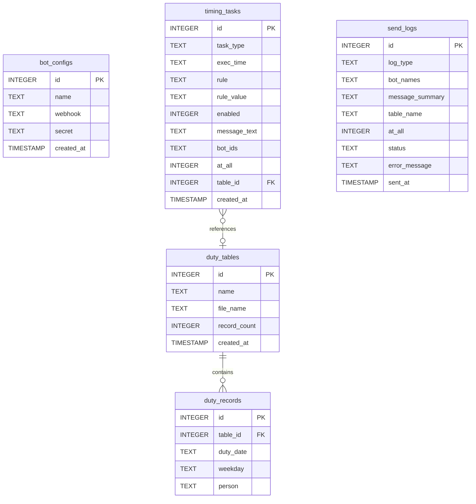
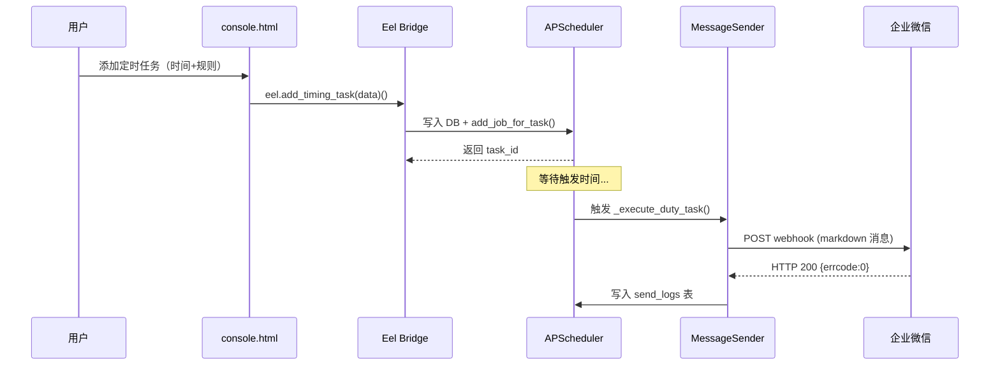

# 值班机器人管理平台 — 功能开发设计文档

> 版本：v3.0.0 | 日期：2026-05-23 | 作者：DutyBot Team

---

## 目录

1. [项目概述](#1-项目概述)
2. [技术架构](#2-技术架构)
3. [前端设计](#3-前端设计)
4. [后端设计](#4-后端设计)
5. [数据库设计](#5-数据库设计)
6. [API 接口设计](#6-api-接口设计)
7. [Eel 桥接层设计](#7-eel-桥接层设计)
8. [定时任务调度设计](#8-定时任务调度设计)
9. [打包部署方案](#9-打包部署方案)
10. [项目目录结构](#10-项目目录结构)
11. [开发计划](#11-开发计划)

---

## 1. 项目概述

### 1.1 项目背景

值班机器人管理平台是一个桌面端工具，用于管理企业微信机器人的值班通知发送。用户可以通过该平台配置多个机器人、上传值班表、设置定时任务，实现值班信息的自动推送。

### 1.2 核心功能

| 模块 | 功能描述 |
|------|----------|
| 值班机器人通知 | 多选机器人 + 选择值班表 + @所有人开关，定时/手动发送值班信息 |
| 自定义消息通知 | 多选机器人 + 自由编辑消息 + @所有人开关，定时/手动发送 |
| 值班信息表管理 | 上传 .xlsx 值班表 → 解析预览 → 保存到本地数据库 |
| 机器人配置管理 | 企业微信机器人 Webhook 的增删改查 |
| 发送日志 | 记录每次发送的时间、目标、内容摘要、状态 |
| 定时任务调度 | 后台 APScheduler 实现精确的定时发送 |

### 1.3 运行形态

- **开发阶段**：通过 `python main.py` 启动，Eel 自动打开桌面窗口
- **交付阶段**：通过 PyInstaller 打包为 macOS `.app` / Windows `.exe` 单文件应用

---

## 2. 技术架构

```
┌─────────────────────────────────────────────────────────┐
│                    PyInstaller 打包层                     │
│  ┌───────────────────────────────────────────────────┐  │
│  │              Eel 桌面壳（Chromium 内核）             │  │
│  │  ┌─────────────────────────────────────────────┐  │  │
│  │  │         前端：console.html                    │  │  │
│  │  │  · 纯 HTML/CSS/JS + SheetJS (xlsx 解析)     │  │  │
│  │  │  · 通过 eel.expose() 调用 Python 后端        │  │  │
│  │  └──────────────────┬──────────────────────────┘  │  │
│  │                     │ WebSocket                    │  │
│  │  ┌──────────────────▼──────────────────────────┐  │  │
│  │  │          Python 后端（main.py）               │  │  │
│  │  │  · Flask（内嵌 HTTP 服务，可选）              │  │  │
│  │  │  · APScheduler（定时任务调度）                │  │  │
│  │  │  · requests（调用企微 Webhook）              │  │  │
│  │  │  · openpyxl（xlsx 解析）                     │  │  │
│  │  └──────────────────┬──────────────────────────┘  │  │
│  │                     │ SQL                         │  │
│  │  ┌──────────────────▼──────────────────────────┐  │  │
│  │  │          SQLite 数据库（dutybot.db）          │  │  │
│  │  └─────────────────────────────────────────────┘  │  │
│  └───────────────────────────────────────────────────┘  │
└─────────────────────────────────────────────────────────┘
```

### 2.1 技术选型说明

| 技术 | 版本 | 用途 |
|------|------|------|
| **Python** | 3.10+ | 后端主语言 |
| **Eel** | 0.16+ | 桌面壳框架，桥接 Python ↔ JS |
| **Flask** | 3.0+ | 内嵌 HTTP 服务（可选，用于 webhook 回调等场景） |
| **APScheduler** | 3.10+ | 定时任务调度引擎 |
| **SQLite** | 内置 | 本地轻量数据库 |
| **requests** | 2.31+ | HTTP 客户端，调用企微 Webhook |
| **openpyxl** | 3.1+ | 服务端 xlsx 解析（与前端 SheetJS 互补） |
| **PyInstaller** | 6.0+ | 打包为独立可执行文件 |
| **SheetJS** | 0.20.0 | 前端 xlsx 解析（CDN 引入） |

> **为什么同时使用 Flask 和 Eel？**
> - Eel 负责桌面窗口和 Python ↔ JS 通信（主通道）
> - Flask 作为内嵌 HTTP 服务，可用于：接收企微回调、暴露健康检查接口、为未来 Web 版扩展预留能力
> - 默认情况下 Flask 不启动，仅在需要时通过配置开启

---

## 3. 前端设计

### 3.1 概述

前端直接使用现有的 `console.html`（单文件应用），**无需任何框架**。通过 Eel 提供的 `eel.expose()` 机制调用 Python 后端函数。

### 3.2 前端改造点

在现有 `console.html` 的基础上，需要做以下适配：

#### 3.2.1 引入 Eel JS 库

```html
<!-- 在 </head> 前添加 -->
<script type="text/javascript" src="/eel.js"></script>
```

`/eel.js` 由 Eel 框架自动提供，暴露全局 `eel` 对象。

#### 3.2.2 替换模拟数据为后端调用

| 现有前端函数 | 改造方式 |
|-------------|----------|
| `sendTest('duty')` | 调用 `eel.send_duty_notification(bot_ids, table_id, at_all)` |
| `sendTest('custom')` | 调用 `eel.send_custom_message(bot_ids, message, at_all)` |
| `confirmAddBot()` | 调用 `eel.add_bot(name, webhook, secret)` |
| `deleteBot(id)` | 调用 `eel.delete_bot(id)` |
| `uploadDutyTable()` | 调用 `eel.save_duty_table(file_name, data)` |
| `deleteDutyFile(id)` | 调用 `eel.delete_duty_table(id)` |
| `confirmTimingTask()` | 调用 `eel.add_timing_task(type, time, rule, rule_value)` |
| `toggleTimer()` | 调用 `eel.toggle_timer(type, active)` |
| 页面初始化 `init()` | 调用 `eel.get_all_data()` 获取所有数据 |

#### 3.2.3 异步回调模式

```javascript
// 示例：发送通知
async function sendTest(type) {
    if (type === 'duty') {
        const botIds = getSelectedDutyBotIds();
        const tableId = document.getElementById('dutyTableSelect').value;
        const atAll = document.getElementById('dutyAtAllToggle').checked;
        if (botIds.length === 0) return showToast('请至少选择一个机器人', 'error');
        if (!tableId) return showToast('请选择值班信息表', 'error');
        try {
            const result = await eel.send_duty_notification(botIds, tableId, atAll)();
            showToast(result.success ? '发送成功' : '发送失败', result.success ? 'success' : 'error');
            refreshLogs();  // 刷新日志
        } catch (err) {
            showToast('发送异常：' + err, 'error');
        }
    }
}
```

### 3.3 前端文件结构

```
dutyBot/
├── web/
│   └── console.html          # 主界面（现有文件，微调适配 Eel）
```

---

## 4. 后端设计

### 4.1 核心模块

```
dutyBot/
├── main.py                   # 应用入口，Eel 初始化 + Flask 启动
├── config.py                 # 全局配置
├── database.py               # SQLite 数据库初始化与连接管理
├── models.py                 # 数据模型（ORM 或原生 SQL 封装）
├── bot_manager.py            # 机器人配置管理
├── duty_table_manager.py     # 值班表管理（上传、解析、存储）
├── message_sender.py         # 企微 Webhook 消息发送
├── scheduler_manager.py      # APScheduler 定时任务管理
├── eel_bridge.py             # Eel 暴露给前端的所有函数
├── flask_routes.py           # Flask HTTP 路由（可选）
└── utils.py                  # 工具函数（日志、文件处理等）
```

### 4.2 main.py — 应用入口

```python
"""
值班机器人管理平台 — 应用入口
启动 Eel 桌面窗口 + 可选 Flask HTTP 服务
"""
import eel
import threading
from config import APP_CONFIG
from database import init_database
from scheduler_manager import init_scheduler
from eel_bridge import register_all_exposures
from flask_routes import create_flask_app

def start_flask():
    """在独立线程中启动 Flask（可选）"""
    if APP_CONFIG.get('enable_flask'):
        app = create_flask_app()
        app.run(
            host=APP_CONFIG.get('flask_host', '127.0.0.1'),
            port=APP_CONFIG.get('flask_port', 5000),
            debug=False
        )

def main():
    # 1. 初始化数据库
    init_database()

    # 2. 注册所有 Eel 暴露函数
    register_all_exposures()

    # 3. 初始化定时任务调度器
    init_scheduler()

    # 4. 启动 Flask（可选，独立线程）
    flask_thread = threading.Thread(target=start_flask, daemon=True)
    flask_thread.start()

    # 5. 启动 Eel 桌面窗口
    eel.init('web')
    eel.start(
        'console.html',
        mode='chrome',          # 使用系统 Chrome/Chromium
        size=(1280, 800),
        port=0,                 # 随机端口
        cmdline_args=['--disable-http-cache']
    )

if __name__ == '__main__':
    main()
```

### 4.3 config.py — 全局配置

```python
import os
import sys

# 判断是否为 PyInstaller 打包环境
IS_FROZEN = getattr(sys, 'frozen', False)
BASE_DIR = sys._MEIPASS if IS_FROZEN else os.path.dirname(os.path.abspath(__file__))

APP_CONFIG = {
    # 数据库路径
    'db_path': os.path.join(
        os.path.expanduser('~'), '.dutybot', 'dutybot.db'
    ),

    # Flask 配置（可选）
    'enable_flask': False,
    'flask_host': '127.0.0.1',
    'flask_port': 5000,

    # 日志
    'log_dir': os.path.join(
        os.path.expanduser('~'), '.dutybot', 'logs'
    ),

    # 定时任务
    'scheduler_max_workers': 3,

    # 企微消息限制
    'max_message_length': 4096,
}
```

### 4.4 database.py — 数据库初始化

```python
"""
SQLite 数据库连接管理与初始化
使用 sqlite3 内置模块，无额外依赖
"""
import sqlite3
import os
from config import APP_CONFIG

DB_PATH = APP_CONFIG['db_path']

def get_connection():
    """获取数据库连接"""
    os.makedirs(os.path.dirname(DB_PATH), exist_ok=True)
    conn = sqlite3.connect(DB_PATH)
    conn.row_factory = sqlite3.Row
    conn.execute("PRAGMA journal_mode=WAL")
    conn.execute("PRAGMA foreign_keys=ON")
    return conn

def init_database():
    """创建所有表（如不存在）"""
    conn = get_connection()
    cursor = conn.cursor()

    # 机器人配置表
    cursor.execute('''
        CREATE TABLE IF NOT EXISTS bot_configs (
            id INTEGER PRIMARY KEY AUTOINCREMENT,
            name TEXT NOT NULL,
            webhook TEXT NOT NULL,
            secret TEXT DEFAULT '',
            created_at TIMESTAMP DEFAULT CURRENT_TIMESTAMP
        )
    ''')

    # 值班信息表元数据
    cursor.execute('''
        CREATE TABLE IF NOT EXISTS duty_tables (
            id INTEGER PRIMARY KEY AUTOINCREMENT,
            name TEXT NOT NULL,
            file_name TEXT NOT NULL,
            record_count INTEGER DEFAULT 0,
            created_at TIMESTAMP DEFAULT CURRENT_TIMESTAMP
        )
    ''')

    # 值班记录明细
    cursor.execute('''
        CREATE TABLE IF NOT EXISTS duty_records (
            id INTEGER PRIMARY KEY AUTOINCREMENT,
            table_id INTEGER NOT NULL,
            duty_date TEXT NOT NULL,
            weekday TEXT NOT NULL,
            person TEXT NOT NULL,
            FOREIGN KEY (table_id) REFERENCES duty_tables(id) ON DELETE CASCADE
        )
    ''')

    # 定时任务配置表
    cursor.execute('''
        CREATE TABLE IF NOT EXISTS timing_tasks (
            id INTEGER PRIMARY KEY AUTOINCREMENT,
            task_type TEXT NOT NULL CHECK(task_type IN ('duty', 'custom')),
            exec_time TEXT NOT NULL,
            rule TEXT NOT NULL,
            rule_value TEXT NOT NULL,
            enabled INTEGER DEFAULT 1,
            -- 自定义消息相关字段（仅 task_type='custom' 时使用）
            message_text TEXT DEFAULT '',
            bot_ids TEXT DEFAULT '',
            at_all INTEGER DEFAULT 0,
            -- 值班通知相关字段（仅 task_type='duty' 时使用）
            table_id INTEGER DEFAULT NULL,
            created_at TIMESTAMP DEFAULT CURRENT_TIMESTAMP
        )
    ''')

    # 发送日志表
    cursor.execute('''
        CREATE TABLE IF NOT EXISTS send_logs (
            id INTEGER PRIMARY KEY AUTOINCREMENT,
            log_type TEXT NOT NULL CHECK(log_type IN ('duty', 'custom')),
            bot_names TEXT NOT NULL,
            message_summary TEXT DEFAULT '',
            table_name TEXT DEFAULT '',
            at_all INTEGER DEFAULT 0,
            status TEXT NOT NULL CHECK(status IN ('success', 'failed')),
            error_message TEXT DEFAULT '',
            sent_at TIMESTAMP DEFAULT CURRENT_TIMESTAMP
        )
    ''')

    conn.commit()
    conn.close()
```

### 4.5 models.py — 数据访问层

```python
"""
数据访问层 — 封装所有 CRUD 操作
"""

class BotConfigModel:
    @staticmethod
    def get_all(conn):
        return conn.execute('SELECT * FROM bot_configs ORDER BY id').fetchall()

    @staticmethod
    def create(conn, name, webhook, secret=''):
        cursor = conn.execute(
            'INSERT INTO bot_configs (name, webhook, secret) VALUES (?, ?, ?)',
            (name, webhook, secret)
        )
        return cursor.lastrowid

    @staticmethod
    def delete(conn, bot_id):
        conn.execute('DELETE FROM bot_configs WHERE id = ?', (bot_id,))

class DutyTableModel:
    @staticmethod
    def get_all(conn):
        return conn.execute('SELECT * FROM duty_tables ORDER BY created_at DESC').fetchall()

    @staticmethod
    def create(conn, name, file_name, record_count):
        cursor = conn.execute(
            'INSERT INTO duty_tables (name, file_name, record_count) VALUES (?, ?, ?)',
            (name, file_name, record_count)
        )
        return cursor.lastrowid

    @staticmethod
    def delete(conn, table_id):
        conn.execute('DELETE FROM duty_tables WHERE id = ?', (table_id,))

    @staticmethod
    def get_records(conn, table_id):
        return conn.execute(
            'SELECT * FROM duty_records WHERE table_id = ? ORDER BY duty_date',
            (table_id,)
        ).fetchall()

    @staticmethod
    def insert_records(conn, table_id, records):
        conn.executemany(
            'INSERT INTO duty_records (table_id, duty_date, weekday, person) VALUES (?, ?, ?, ?)',
            [(table_id, r['date'], r['weekday'], r['person']) for r in records]
        )

class TimingTaskModel:
    @staticmethod
    def get_all(conn):
        return conn.execute('SELECT * FROM timing_tasks ORDER BY id').fetchall()

    @staticmethod
    def get_by_type(conn, task_type):
        return conn.execute(
            'SELECT * FROM timing_tasks WHERE task_type = ? ORDER BY id',
            (task_type,)
        ).fetchall()

    @staticmethod
    def create(conn, data):
        cursor = conn.execute('''
            INSERT INTO timing_tasks (task_type, exec_time, rule, rule_value, enabled,
                message_text, bot_ids, at_all, table_id)
            VALUES (?, ?, ?, ?, 1, ?, ?, ?, ?)
        ''', (
            data['task_type'], data['exec_time'], data['rule'],
            data['rule_value'], data.get('message_text', ''),
            data.get('bot_ids', ''), data.get('at_all', 0),
            data.get('table_id')
        ))
        return cursor.lastrowid

    @staticmethod
    def update_enabled(conn, task_id, enabled):
        conn.execute(
            'UPDATE timing_tasks SET enabled = ? WHERE id = ?',
            (1 if enabled else 0, task_id)
        )

    @staticmethod
    def delete(conn, task_id):
        conn.execute('DELETE FROM timing_tasks WHERE id = ?', (task_id,))

class SendLogModel:
    @staticmethod
    def get_all(conn, log_type=None, limit=100):
        if log_type:
            return conn.execute(
                'SELECT * FROM send_logs WHERE log_type = ? ORDER BY sent_at DESC LIMIT ?',
                (log_type, limit)
            ).fetchall()
        return conn.execute(
            'SELECT * FROM send_logs ORDER BY sent_at DESC LIMIT ?',
            (limit,)
        ).fetchall()

    @staticmethod
    def create(conn, data):
        conn.execute('''
            INSERT INTO send_logs (log_type, bot_names, message_summary, table_name, at_all, status, error_message)
            VALUES (?, ?, ?, ?, ?, ?, ?)
        ''', (
            data['log_type'], data['bot_names'], data.get('message_summary', ''),
            data.get('table_name', ''), data.get('at_all', 0),
            data['status'], data.get('error_message', '')
        ))
```

### 4.6 bot_manager.py — 机器人管理

```python
"""
机器人配置管理模块
"""
from database import get_connection
from models import BotConfigModel

def get_all_bots():
    conn = get_connection()
    bots = BotConfigModel.get_all(conn)
    conn.close()
    return [dict(b) for b in bots]

def add_bot(name, webhook, secret=''):
    conn = get_connection()
    bot_id = BotConfigModel.create(conn, name, webhook, secret)
    conn.commit()
    conn.close()
    return {'id': bot_id, 'name': name}

def delete_bot(bot_id):
    conn = get_connection()
    BotConfigModel.delete(conn, bot_id)
    conn.commit()
    conn.close()
    return {'success': True}
```

### 4.7 duty_table_manager.py — 值班表管理

```python
"""
值班表管理模块 — 上传、解析、存储
"""
import os
import openpyxl
from database import get_connection
from models import DutyTableModel

def parse_xlsx(file_path):
    """解析 xlsx 文件，返回记录列表"""
    wb = openpyxl.load_workbook(file_path, read_only=True)
    ws = wb.active
    rows = list(ws.iter_rows(min_row=2, values_only=True))

    records = []
    for row in rows:
        if row[0] and row[2]:  # 日期和人员不为空
            records.append({
                'date': str(row[0]).strip(),
                'weekday': str(row[1]).strip() if row[1] else '',
                'person': str(row[2]).strip()
            })
    wb.close()
    return records

def save_duty_table(file_path, file_name):
    """保存值班表到数据库"""
    records = parse_xlsx(file_path)
    if not records:
        return {'success': False, 'error': '未解析到有效数据'}

    name = os.path.splitext(file_name)[0]
    conn = get_connection()
    table_id = DutyTableModel.create(conn, name, file_name, len(records))
    DutyTableModel.insert_records(conn, table_id, records)
    conn.commit()
    conn.close()

    return {'success': True, 'id': table_id, 'name': name, 'count': len(records)}

def get_all_tables():
    conn = get_connection()
    tables = DutyTableModel.get_all(conn)
    conn.close()
    return [dict(t) for t in tables]

def get_table_records(table_id):
    conn = get_connection()
    records = DutyTableModel.get_records(conn, table_id)
    conn.close()
    return [dict(r) for r in records]

def delete_duty_table(table_id):
    conn = get_connection()
    DutyTableModel.delete(conn, table_id)
    conn.commit()
    conn.close()
    return {'success': True}
```

### 4.8 message_sender.py — 消息发送

```python
"""
企业微信机器人消息发送模块
文档：https://developer.work.weixin.qq.com/document/path/91770
"""
import requests
import json
from database import get_connection
from models import BotConfigModel, DutyTableModel, SendLogModel

WEBHOOK_TIMEOUT = 10  # 秒

def _build_duty_message(table_id):
    """构建值班通知消息"""
    conn = get_connection()
    records = DutyTableModel.get_records(conn, table_id)
    conn.close()

    if not records:
        return "暂无值班信息"

    lines = ["## 📋 值班通知\n"]
    lines.append("| 日期 | 星期 | 值班人员 |")
    lines.append("|------|------|----------|")
    for r in records:
        lines.append(f"| {r['duty_date']} | {r['weekday']} | **{r['person']}** |")

    return "\n".join(lines)

def send_duty_notification(bot_ids, table_id, at_all=False):
    """发送值班通知到指定机器人"""
    message = _build_duty_message(table_id)
    return _send_to_bots(bot_ids, message, at_all, log_type='duty', table_id=table_id)

def send_custom_message(bot_ids, message_text, at_all=False):
    """发送自定义消息到指定机器人"""
    return _send_to_bots(bot_ids, message_text, at_all, log_type='custom')

def _send_to_bots(bot_ids, message, at_all, log_type, table_id=None):
    """核心发送逻辑"""
    conn = get_connection()
    bots = BotConfigModel.get_all(conn)
    bot_map = {b['id']: b for b in bots}

    bot_names = []
    all_success = True
    last_error = ''

    for bot_id in bot_ids:
        bot = bot_map.get(int(bot_id))
        if not bot:
            continue

        bot_names.append(bot['name'])
        payload = {
            "msgtype": "markdown",
            "markdown": {
                "content": message
            }
        }

        # @所有人（仅 text 类型支持，markdown 类型需单独处理）
        # 企业微信 markdown 类型不支持 @all，需转换为 text 类型或拼接 <@all>
        if at_all:
            payload["markdown"]["content"] += "\n<@all>"

        try:
            resp = requests.post(
                bot['webhook'],
                json=payload,
                timeout=WEBHOOK_TIMEOUT
            )
            if resp.status_code != 200 or resp.json().get('errcode') != 0:
                all_success = False
                last_error = resp.text[:200]
        except requests.RequestException as e:
            all_success = False
            last_error = str(e)[:200]

    # 记录日志
    table_name = ''
    if table_id:
        tables = DutyTableModel.get_all(conn)
        table_map = {t['id']: t for t in tables}
        table_name = table_map.get(table_id, {}).get('name', '')

    SendLogModel.create(conn, {
        'log_type': log_type,
        'bot_names': '、'.join(bot_names),
        'message_summary': message[:100],
        'table_name': table_name,
        'at_all': 1 if at_all else 0,
        'status': 'success' if all_success else 'failed',
        'error_message': last_error
    })
    conn.commit()
    conn.close()

    return {
        'success': all_success,
        'bot_names': '、'.join(bot_names),
        'error': last_error
    }
```

### 4.9 scheduler_manager.py — 定时任务调度

```python
"""
定时任务调度模块 — 基于 APScheduler
"""
from apscheduler.schedulers.background import BackgroundScheduler
from apscheduler.triggers.cron import CronTrigger
from database import get_connection
from models import TimingTaskModel
from message_sender import send_duty_notification, send_custom_message
import logging

logger = logging.getLogger(__name__)
scheduler = BackgroundScheduler()

# 存储 job_id → task_id 的映射
_job_task_map = {}

def _execute_duty_task(task):
    """执行值班通知定时任务"""
    bot_ids = [int(x) for x in task['bot_ids'].split(',') if x]
    table_id = task['table_id']
    at_all = bool(task['at_all'])
    if bot_ids and table_id:
        result = send_duty_notification(bot_ids, table_id, at_all)
        logger.info(f"定时值班通知: {result}")

def _execute_custom_task(task):
    """执行自定义消息定时任务"""
    bot_ids = [int(x) for x in task['bot_ids'].split(',') if x]
    message = task['message_text']
    at_all = bool(task['at_all'])
    if bot_ids and message:
        result = send_custom_message(bot_ids, message, at_all)
        logger.info(f"定时自定义消息: {result}")

def _build_cron_trigger(rule_value, exec_time):
    """根据规则构建 CronTrigger"""
    hour, minute = exec_time.split(':')

    if rule_value == 'daily':
        return CronTrigger(hour=int(hour), minute=int(minute))
    elif rule_value == 'weekday':
        return CronTrigger(hour=int(hour), minute=int(minute), day_of_week='mon-fri')
    elif rule_value.startswith('weekly_'):
        # weekly_1,2,3 格式
        days = rule_value.replace('weekly_', '').split(',')
        return CronTrigger(hour=int(hour), minute=int(minute), day_of_week=','.join(days))
    else:
        return CronTrigger(hour=int(hour), minute=int(minute))

def add_job_for_task(task):
    """为单个任务添加调度 Job"""
    task_id = task['id']
    job_id = f"task_{task_id}"

    # 移除已存在的 Job
    if job_id in _job_task_map:
        scheduler.remove_job(job_id)

    trigger = _build_cron_trigger(task['rule_value'], task['exec_time'])

    if task['task_type'] == 'duty':
        scheduler.add_job(
            _execute_duty_task,
            trigger=trigger,
            args=[task],
            id=job_id,
            replace_existing=True
        )
    else:
        scheduler.add_job(
            _execute_custom_task,
            trigger=trigger,
            args=[task],
            id=job_id,
            replace_existing=True
        )

    _job_task_map[job_id] = task_id

def remove_job_for_task(task_id):
    """移除任务的调度 Job"""
    job_id = f"task_{task_id}"
    if job_id in _job_task_map:
        scheduler.remove_job(job_id)
        del _job_task_map[job_id]

def reload_all_jobs():
    """从数据库加载所有启用的任务并注册调度"""
    conn = get_connection()
    tasks = TimingTaskModel.get_all(conn)
    conn.close()

    # 清除所有旧 Job
    for job_id in list(_job_task_map.keys()):
        try:
            scheduler.remove_job(job_id)
        except Exception:
            pass
    _job_task_map.clear()

    # 重新注册启用的任务
    for task in tasks:
        if task['enabled']:
            add_job_for_task(task)

def init_scheduler():
    """初始化调度器并启动"""
    reload_all_jobs()
    if not scheduler.running:
        scheduler.start()
    logger.info("定时任务调度器已启动")
```

### 4.10 eel_bridge.py — Eel 桥接层

```python
"""
Eel 桥接层 — 所有暴露给前端 JS 的函数
使用 @eel.expose 装饰器标记
"""
import eel
import json
from bot_manager import get_all_bots, add_bot, delete_bot
from duty_table_manager import (
    get_all_tables, get_table_records, delete_duty_table
)
from message_sender import send_duty_notification, send_custom_message
from models import TimingTaskModel, SendLogModel
from database import get_connection
from scheduler_manager import add_job_for_task, remove_job_for_task, reload_all_jobs

# ==================== 初始化数据 ====================

@eel.expose
def get_all_data():
    """前端初始化时获取全部数据"""
    conn = get_connection()
    bots = [dict(b) for b in BotConfigModel.__dict__ if False]  # placeholder
    conn.close()
    # 实际实现中返回所有需要的数据
    return {
        'bots': get_all_bots(),
        'duty_tables': get_all_tables(),
        'duty_tasks': _get_tasks_by_type('duty'),
        'custom_tasks': _get_tasks_by_type('custom'),
        'duty_logs': _get_logs_by_type('duty'),
        'custom_logs': _get_logs_by_type('custom'),
    }

# ==================== 机器人配置 ====================

@eel.expose
def create_bot(name, webhook, secret=''):
    return add_bot(name, webhook, secret)

@eel.expose
def remove_bot(bot_id):
    return delete_bot(bot_id)

# ==================== 值班表管理 ====================

@eel.expose
def get_duty_tables():
    return get_all_tables()

@eel.expose
def get_duty_records(table_id):
    return get_table_records(table_id)

@eel.expose
def remove_duty_table(table_id):
    return delete_duty_table(table_id)

# ==================== 消息发送 ====================

@eel.expose
def send_duty_notification_eel(bot_ids, table_id, at_all=False):
    return send_duty_notification(bot_ids, table_id, at_all)

@eel.expose
def send_custom_message_eel(bot_ids, message_text, at_all=False):
    return send_custom_message(bot_ids, message_text, at_all)

# ==================== 定时任务管理 ====================

@eel.expose
def add_timing_task(task_data):
    """添加定时任务"""
    conn = get_connection()
    task_id = TimingTaskModel.create(conn, task_data)
    conn.commit()
    # 获取完整 task 信息并注册到调度器
    task = dict(conn.execute(
        'SELECT * FROM timing_tasks WHERE id = ?', (task_id,)
    ).fetchone())
    conn.close()
    if task['enabled']:
        add_job_for_task(task)
    return {'id': task_id}

@eel.expose
def remove_timing_task(task_id):
    conn = get_connection()
    TimingTaskModel.delete(conn, task_id)
    conn.commit()
    conn.close()
    remove_job_for_task(task_id)
    return {'success': True}

@eel.expose
def toggle_timing_task(task_id, enabled):
    conn = get_connection()
    TimingTaskModel.update_enabled(conn, task_id, enabled)
    conn.commit()
    task = dict(conn.execute(
        'SELECT * FROM timing_tasks WHERE id = ?', (task_id,)
    ).fetchone())
    conn.close()
    if enabled:
        add_job_for_task(task)
    else:
        remove_job_for_task(task_id)
    return {'success': True}

# ==================== 日志 ====================

@eel.expose
def get_send_logs(log_type=None):
    conn = get_connection()
    logs = SendLogModel.get_all(conn, log_type)
    conn.close()
    return [dict(l) for l in logs]

@eel.expose
def clear_send_logs(log_type=None):
    conn = get_connection()
    if log_type:
        conn.execute('DELETE FROM send_logs WHERE log_type = ?', (log_type,))
    else:
        conn.execute('DELETE FROM send_logs')
    conn.commit()
    conn.close()
    return {'success': True}

# ==================== 辅助函数 ====================

def _get_tasks_by_type(task_type):
    conn = get_connection()
    tasks = TimingTaskModel.get_by_type(conn, task_type)
    conn.close()
    return [dict(t) for t in tasks]

def _get_logs_by_type(log_type):
    conn = get_connection()
    logs = SendLogModel.get_all(conn, log_type)
    conn.close()
    return [dict(l) for l in logs]

def register_all_exposures():
    """确保所有 @eel.expose 函数被注册（导入即注册）"""
    pass
```

### 4.11 flask_routes.py — Flask HTTP 路由（可选）

```python
"""
Flask HTTP 路由 — 可选模块
提供 REST API，可用于 Webhook 回调、健康检查等
"""
from flask import Flask, request, jsonify
from bot_manager import get_all_bots, add_bot, delete_bot
from message_sender import send_duty_notification, send_custom_message

def create_flask_app():
    app = Flask(__name__)

    # ---- 健康检查 ----
    @app.route('/api/health')
    def health():
        return jsonify({'status': 'ok', 'service': 'dutybot'})

    # ---- 机器人配置 API ----
    @app.route('/api/bots', methods=['GET'])
    def api_get_bots():
        return jsonify(get_all_bots())

    @app.route('/api/bots', methods=['POST'])
    def api_add_bot():
        data = request.get_json()
        result = add_bot(
            data.get('name'),
            data.get('webhook'),
            data.get('secret', '')
        )
        return jsonify(result), 201

    @app.route('/api/bots/<int:bot_id>', methods=['DELETE'])
    def api_delete_bot(bot_id):
        return jsonify(delete_bot(bot_id))

    # ---- 发送消息 API ----
    @app.route('/api/send/duty', methods=['POST'])
    def api_send_duty():
        data = request.get_json()
        result = send_duty_notification(
            data['bot_ids'],
            data['table_id'],
            data.get('at_all', False)
        )
        return jsonify(result)

    @app.route('/api/send/custom', methods=['POST'])
    def api_send_custom():
        data = request.get_json()
        result = send_custom_message(
            data['bot_ids'],
            data['message'],
            data.get('at_all', False)
        )
        return jsonify(result)

    return app
```

---

## 5. 数据库设计

### 5.1 ER 图



### 5.2 数据库文件位置

- **开发环境**：`~/.dutybot/dutybot.db`
- **打包后**：`~/.dutybot/dutybot.db`（用户主目录下，确保可写）

---

## 6. API 接口设计

### 6.1 Eel 内部接口（JS ↔ Python）

所有 Eel 接口通过 WebSocket 通信，前端通过 `eel.function_name()()` 异步调用。

| 前端调用 | Python 函数 | 说明 |
|----------|------------|------|
| `eel.get_all_data()()` | `get_all_data()` | 获取全部初始化数据 |
| `eel.create_bot(name, url, secret)()` | `create_bot()` | 添加机器人 |
| `eel.remove_bot(id)()` | `remove_bot()` | 删除机器人 |
| `eel.send_duty_notification_eel(bot_ids, table_id, at_all)()` | `send_duty_notification_eel()` | 发送值班通知 |
| `eel.send_custom_message_eel(bot_ids, msg, at_all)()` | `send_custom_message_eel()` | 发送自定义消息 |
| `eel.add_timing_task(data)()` | `add_timing_task()` | 添加定时任务 |
| `eel.remove_timing_task(id)()` | `remove_timing_task()` | 删除定时任务 |
| `eel.toggle_timing_task(id, enabled)()` | `toggle_timing_task()` | 启停定时任务 |
| `eel.get_send_logs(type)()` | `get_send_logs()` | 获取发送日志 |
| `eel.clear_send_logs(type)()` | `clear_send_logs()` | 清空日志 |
| `eel.get_duty_tables()()` | `get_duty_tables()` | 获取值班表列表 |
| `eel.get_duty_records(id)()` | `get_duty_records()` | 获取值班记录 |
| `eel.remove_duty_table(id)()` | `remove_duty_table()` | 删除值班表 |

### 6.2 Flask REST API（可选）

| 方法 | 路径 | 说明 |
|------|------|------|
| GET | `/api/health` | 健康检查 |
| GET | `/api/bots` | 获取所有机器人 |
| POST | `/api/bots` | 添加机器人 |
| DELETE | `/api/bots/<id>` | 删除机器人 |
| POST | `/api/send/duty` | 发送值班通知 |
| POST | `/api/send/custom` | 发送自定义消息 |

---

## 7. Eel 桥接层设计

### 7.1 通信协议

```
┌──────────┐                    ┌──────────┐
│  console │  eel.func()()      │  Python  │
│  .html   │ ──── WebSocket ──→ │  @eel    │
│  (JS)    │ ←── JSON result ── │  .expose │
└──────────┘                    └──────────┘
```

### 7.2 调用约定

- Python 暴露函数：使用 `@eel.expose` 装饰器
- JS 调用方式：`eel.python_function_name(args)()` — 注意末尾的 `()` 触发异步执行
- 返回值：Python 函数返回 dict/list，自动序列化为 JSON
- 回调支持：`eel.python_function_name(args)(callback_function)`

---

## 8. 定时任务调度设计

### 8.1 调度流程



### 8.2 Cron 表达式映射

| 前端规则 | rule_value | APScheduler CronTrigger |
|----------|-----------|------------------------|
| 每天 | `daily` | `hour=X, minute=Y` |
| 工作日 | `weekday` | `hour=X, minute=Y, day_of_week='mon-fri'` |
| 每周（选周一周三） | `weekly_1,3` | `hour=X, minute=Y, day_of_week='1,3'` |

### 8.3 调度器生命周期

- **启动**：`main.py` 中 `init_scheduler()` → 加载 DB 中所有 enabled=1 的任务
- **添加任务**：`add_timing_task()` → 写库 + 注册 Job
- **启停任务**：`toggle_timing_task()` → 更新库 + add/remove Job
- **删除任务**：`remove_timing_task()` → 删库 + remove Job
- **停止**：应用退出时 `scheduler.shutdown(wait=False)`

---

## 9. 打包部署方案

### 9.1 PyInstaller 配置

**目录结构：**

```
dutyBot/
├── main.py
├── web/
│   └── console.html
├── dutybot.spec          # PyInstaller 配置文件
└── requirements.txt
```

**`dutybot.spec`（PyInstaller 配置）：**

```python
# -*- mode: python ; coding: utf-8 -*-

a = Analysis(
    ['main.py'],
    pathex=[],
    binaries=[],
    datas=[
        ('web/console.html', 'web'),
        ('web/eel.js', 'web'),       # Eel 生成的
    ],
    hiddenimports=[
        'apscheduler',
        'apscheduler.triggers.cron',
        'openpyxl',
        'requests',
        'eel',
        'flask',
        'sqlite3',
    ],
    hookspath=[],
    hooksconfig={},
    runtime_hooks=[],
    excludes=[],
    noarchive=False,
)

pyz = PYZ(a.pure)

exe = EXE(
    pyz,
    a.scripts,
    a.binaries,
    a.datas,
    name='dutyBot',
    debug=False,
    bootloader_ignore_signals=False,
    strip=False,
    upx=True,
    console=False,                    # macOS .app 不需要终端窗口
    disable_windowed_traceback=False,
    argv_emulation=False,
    target_arch=None,
    codesign_identity=None,
    entitlements_file=None,
    icon='web/favicon.ico',           # 应用图标
)

app = BUNDLE(
    exe,
    name='dutyBot.app',
    icon='web/favicon.ico',
    bundle_identifier='com.dutybot.app',
)
```

### 9.2 `requirements.txt`

```
eel>=0.16.0
Flask>=3.0.0
APScheduler>=3.10.0
requests>=2.31.0
openpyxl>=3.1.0
PyInstaller>=6.0.0
```

### 9.3 打包命令

```bash
# 安装依赖
pip install -r requirements.txt

# 开发运行
python main.py

# 打包为 macOS .app
pyinstaller dutybot.spec --clean --noconfirm

# 打包为 Windows .exe（在 Windows 上执行）
pyinstaller dutybot.spec --clean --noconfirm

# 打包为单文件（Windows 可选）
pyinstaller --onefile --windowed --name dutyBot main.py
```

### 9.4 数据持久化路径

打包后的应用将数据存储在用户主目录下：

- **数据库**：`~/.dutybot/dutybot.db`
- **日志**：`~/.dutybot/logs/dutybot.log`
- **上传文件缓存**：`~/.dutybot/uploads/`

---

## 10. 项目目录结构

```
dutyBot/
├── main.py                    # 应用入口
├── config.py                  # 全局配置
├── database.py                # 数据库初始化
├── models.py                  # 数据访问层
├── bot_manager.py             # 机器人管理
├── duty_table_manager.py      # 值班表管理
├── message_sender.py          # 消息发送
├── scheduler_manager.py       # 定时任务调度
├── eel_bridge.py              # Eel 桥接层
├── flask_routes.py            # Flask 路由（可选）
├── utils.py                   # 工具函数
├── dutybot.spec               # PyInstaller 打包配置
├── requirements.txt           # Python 依赖
├── requirement.md             # 本文档
├── README.md                  # 使用说明
├── web/
│   └── console.html           # 前端主界面
├── tests/
│   ├── test_bot_manager.py
│   ├── test_message_sender.py
│   └── test_scheduler.py
└── assets/
    └── favicon.ico            # 应用图标
```

---

## 11. 开发计划

### 第一阶段：核心后端（预计 3–5 天）

| 任务 | 产出 |
|------|------|
| 搭建项目骨架 | `main.py`, `config.py`, `requirements.txt` |
| 数据库设计与初始化 | `database.py`, `models.py` 及 5 张表 |
| 机器人 CRUD | `bot_manager.py` + Eel 暴露 |
| 值班表上传与解析 | `duty_table_manager.py`（openpyxl 解析 + 存储） |
| 企微消息发送 | `message_sender.py`（真实 HTTP 调用） |

### 第二阶段：定时调度 + 前端对接（预计 2–3 天）

| 任务 | 产出 |
|------|------|
| APScheduler 集成 | `scheduler_manager.py`，cron 任务注册/启停 |
| Eel 桥接层 | `eel_bridge.py`，所有 `@eel.expose` 函数 |
| 前端适配 | `console.html` 替换模拟调用为 `eel.xxx()()` |
| Flask 路由（可选） | `flask_routes.py` |

### 第三阶段：测试与打包（预计 1–2 天）

| 任务 | 产出 |
|------|------|
| 单元测试 | `tests/` 目录 |
| 集成测试 | 端到端流程验证 |
| PyInstaller 打包 | `dutybot.spec` → `.app` / `.exe` |
| 文档完善 | `README.md` 使用说明 |

---

> **文档版本**：v1.0 | **最后更新**：2026-05-23
